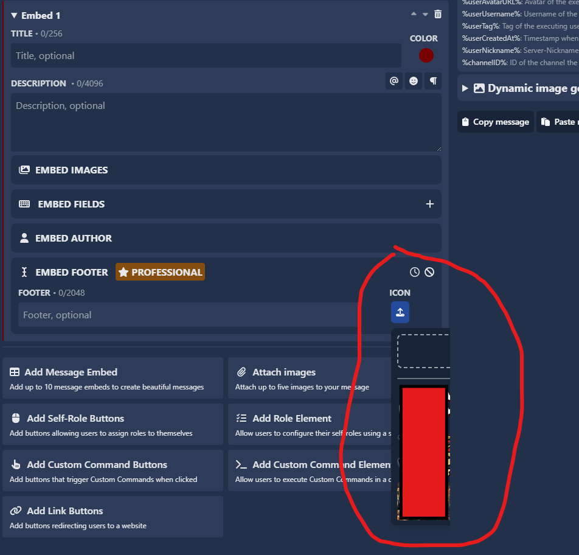

# Image fixes & feature

In this update, SCNX fixed a bug and added a new button to the image gallery.

## New button called "Load more images" added

When you have **26 or more pictures** stored in SCNX, this button will automatically appear at the bottom of your image gallery. By clicking on the **"Load more images"** button, additional pictures will be loaded and displayed seamlessly, allowing you to browse through your entire collection without having to upload the images again.

This enhancement improves the user experience by making image browsing faster and more convenient, especially for users with large image libraries.

## Bug fixed

There was an error where you couldn't even see half of your image gallery.

This bug has been fixed.

:::info  
If you are still getting this error, please don't hesitate to contact support in the official ScootKit Discord server.  
:::