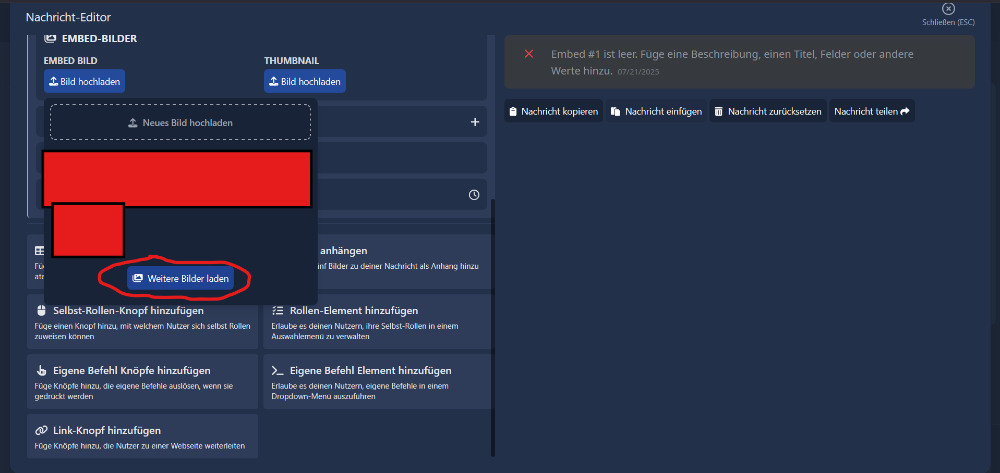
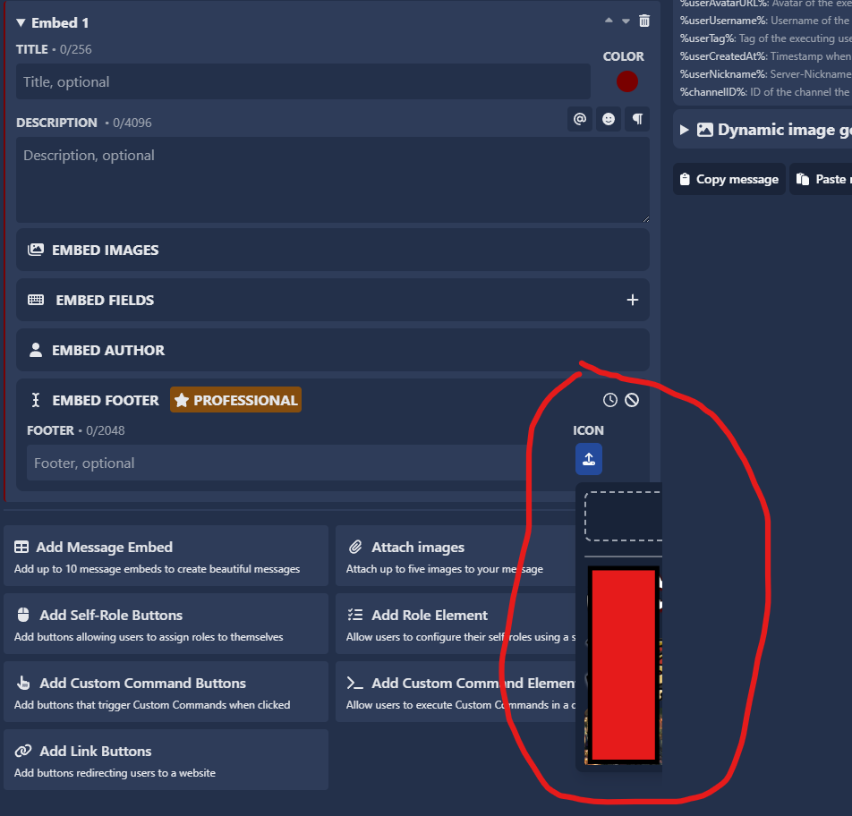

# Bildkorrekturen & neue Funktion

In diesem Update hat SCNX einen Fehler behoben und einen neuen Button zur Bildergalerie hinzugefügt.

## Neuer Button „Mehr Bilder laden“ hinzugefügt

Wenn du **26 oder mehr Bilder** in SCNX gespeichert hast, erscheint dieser Button automatisch am unteren Ende deiner Bildergalerie. Durch einen Klick auf den **„Mehr Bilder laden“**-Button werden weitere Bilder nachgeladen und nahtlos angezeigt, sodass du deine gesamte Sammlung durchstöbern kannst, ohne die Bilder erneut hochladen zu müssen.

Diese Verbesserung sorgt für ein schnelleres und bequemeres Durchblättern, besonders für Nutzer mit großen Bildersammlungen.

## Fehler behoben

Es gab einen Fehler, bei dem man nicht einmal die Hälfte seiner Bildergalerie sehen konnte.

Dieser Fehler wurde behoben.

:::info
Falls du diesen Fehler weiterhin bekommst, zögere bitte nicht und kontaktiere den Support im offiziellen ScootKit Discord Server.
:::