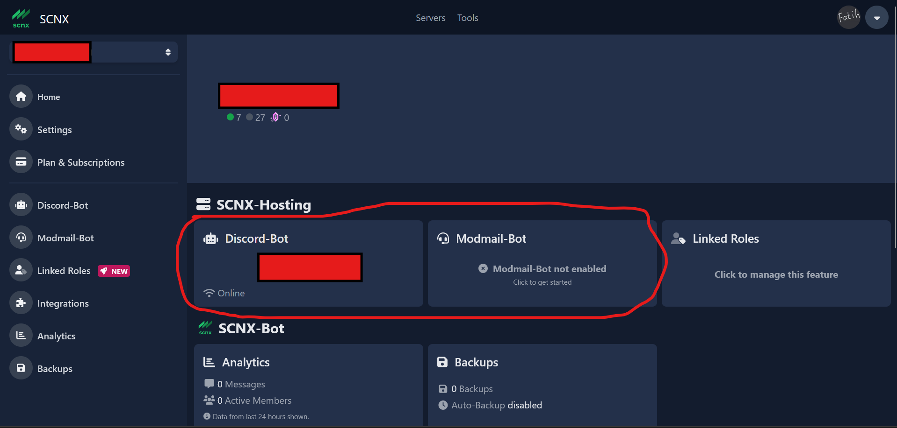
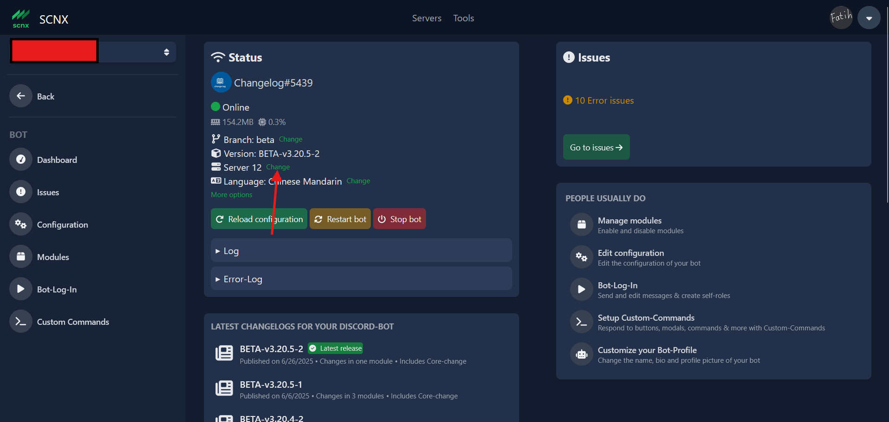

# How to Change the Hosting Server in SCNX

Here is a **step-by-step tutorial** on how to change the hosting server in SCNX. This guide works for both the **Custom Bot** and the **Modmail Bot**.

---

## 1️⃣ Go to [https://scnx.app](https://scnx.app) and select your server.

---

## 2️⃣ Select which bot you want to change the server for — either the **Custom Bot** or the **Modmail Bot**.

---

## 3️⃣ Once you are in the dashboard, click on the **Change** button next to “Server XX.”

---

## 4️⃣ Choose a new server.
There are a total of **29 servers** available (with 3 of them offering **Premium Hosting**).  
After selecting your new server, scroll down and click on the **red “Confirm” button**. Wait a few seconds.

If the change is **successful**, congratulations! 🎉 You’ve just changed the hosting server of your Discord bot.

---

:::danger
If your current server is **offline due to technical issues**, you **cannot change the server**.  
Doing so while the server is offline is **extremely dangerous** and might lead to data loss or further issues.  

Please be patient until your server is back online — after that, you can safely proceed with the server change.
:::